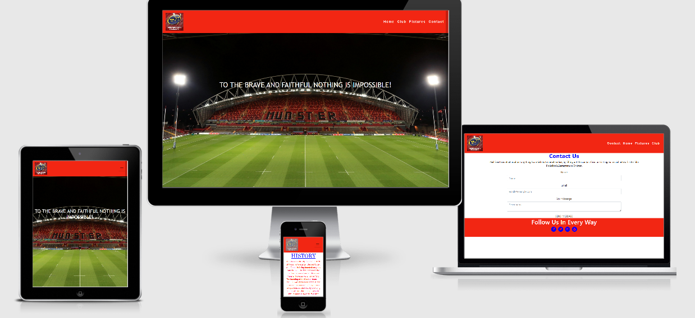
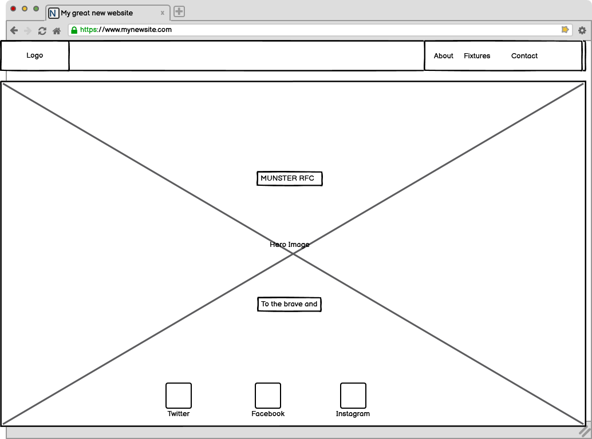
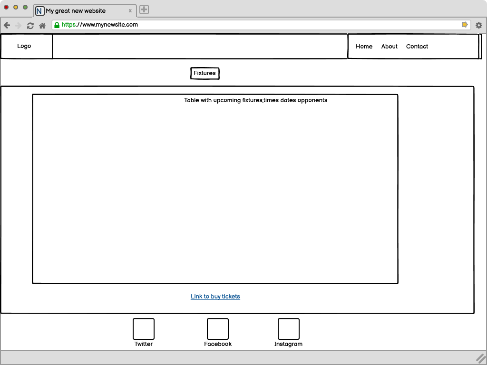
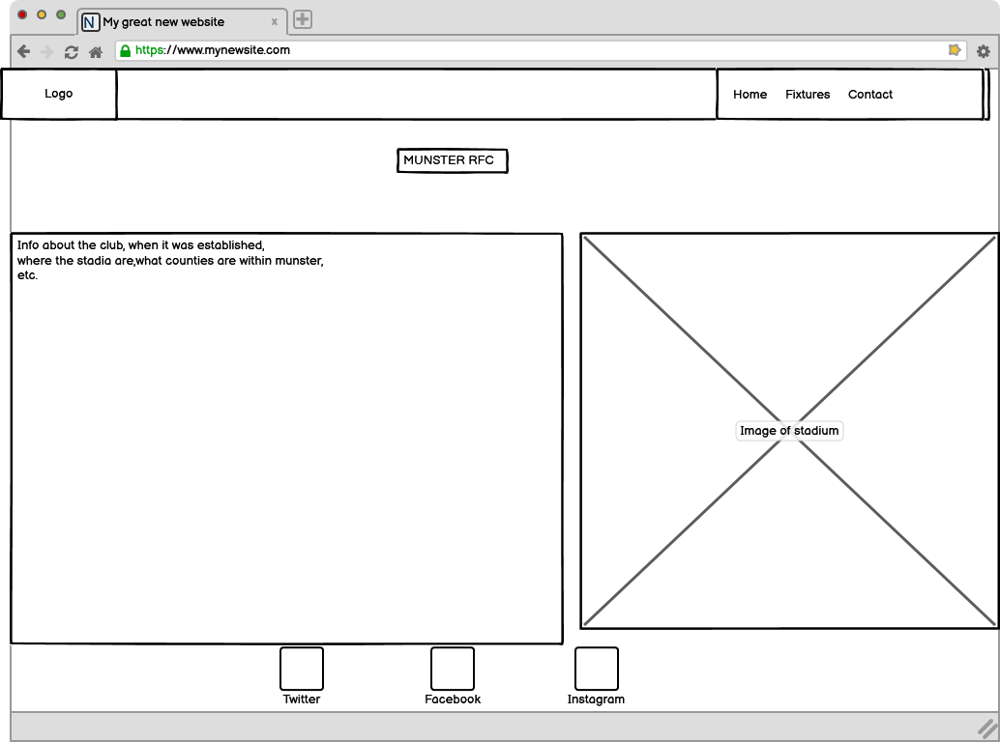
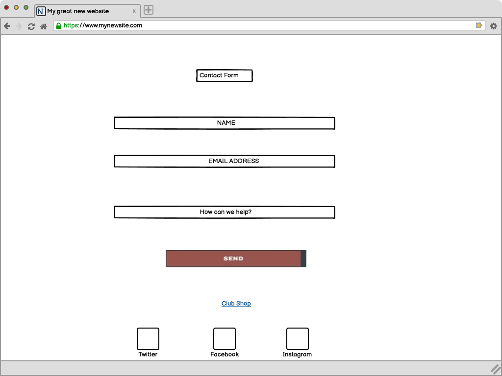

# [Munster RFC](https://mikey17.github.io/Munster-RFC-MS1/)

MS1 Project-Codeinstitute

This is my website based on Munster Rugby Football Club.

## **UX**

## User Stories

#### 1. First Time User

- As a first time user, I want to easily find my way around the site and find what Im looking for quickly.
- As a first time user, I want to be able to check on the future fixtures of the team and see their schedule.
- I want to find information on the Munster Rugby team and also look at images/videos and read about some history on the team.
- As a fan, I want to be able to view merchandise and order/buy merchandise, or else have a link to be able to do so.
- As a First time user, I want to see if there are any links to the clubs social media channels.

#### 2. Returning User

- As a returning user, I want to check on the results of the team.
- As a returning user, I want to check on upcoming fixtures again see if the matches are being shown on television, as with covid19 I cant get to the matches.
- As a returning user, I want to see if there is any new updates about the team or club as a whole.

#### Design

- I wanted to use red and blue mainly in my colour scheme as they are the
colours of the club and I wanted to keep these colours prevalent.
- The image of the stadium I used on the home page was to showcase the stadium 
and also grab the users attention.
- I wanted to show the upcoming fixtures,dates,times and tv channels as it is a good way to get users to return and shows everything on one page.
- I wanted a contact page so users can get in contact with me, regarding any queries they may have.
- The club page was created to get users some information on the past of the club and also so they could see some of the clubs best moments.

#### Strategy

My aim in the design was to keep the home page simplistic with a captivating image to get fans/users attention
immediately.I also wanted the user to be able to naviagte the site very easily and have it as user-friendly as possible.

#### Scope

For users, I wanted to provide them with as much info about Munster RFC as possible.
I also wanted to add options for merchandise (through a link).I also wanted to have a contact page within my site,so a user could
get in contact with the club easily on any matter they wanted addressing. Fits with my current ability and the content is visible imediately.Plus to have social media links to be able to connect with the 
user in a different way.

#### Structure

 The main focus of the structure is to allow users to quickly get information there looking for. 
  I didnt want to have too much text as not to overwhelm the user and also keep the site tidy and flowing.
 A video to  get the users excited and have them reminiscing about the past glories.
 Users can get in contact very easily through a contact form and also through social media links in the footer.

#### Skeleton

- Home Wireframe 
- Fixtures Wireframe 
- Club Wireframe  
- Contact Wireframe 
- Fixed nav bar with headings pointing to each page.
- Fixed footer with social media icons.
- Buttons in home page to link to sites other pages and a seperate site where merchandise can be bought.
#### Surface

The hero image on the homescreen was to showcase the stadium
the club play their matches in. The color scheme was in-line 
with the clubs colors of blue and red. I chose a white background and black text as i felt it is more readable,as i was
 going to go with a blue background first. The video was selected as I feel it gives not just one great moment but a variety of moments and could be watch numerous times.
 

## **Technologies**

 * HTML
 * CSS
 * BOOTSTRAP
 * GOOGLE FONTS
 * FONT AWESOME
 * HOVER.CSS
 * GITHUB
 * BALSAMIQ

## **Testing**

- To test my CSS I used the [W3C validation service](https://validator.w3.org/)
- To test my HTML I also used the [W3C validation service](https://validator.w3.org/)
- I tested my site on a variety of different size devices to check if it was responsive.
- Also I tested the site on different browsers to check for functionality.
- Within the coding I tested the links every so often to make sure they were working properly, and directing to where I wanted.

## **Bugs**

- On some mobile devices my table on the fixtures page is not 100% responsive,
and with further time I hope to eradicate this.

## **Deployment**

- This project was deployed on githubpages.com, to deploy the project:
- 1. login to github and locate repository.
- 2. at the top of the repo click the settings button.
- 3. locate github pages section.
- 4. under source, click the dropdown called none and select the Master Branch.
- 5. go back down through the page and finf the site link in github pages section.

## **Credits**

- Thomondpark.ie for my background image used throughout the site.
- Pinterest.ie for my logo used on my navbar.
- Bootstrap4.com for my nav and code throughout the project.
- Googlefonts.com for the font I used in the site.
- Fontawesome.com for the icons in my footer.

## **Acknowledgements**

- My mentor at Codeinstitute
- All the tutors at Codeinstitute
- My fellow students at Codeinstitute
- Slack

This site is for educational purposes only!

